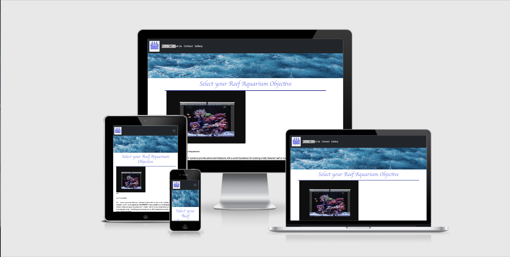
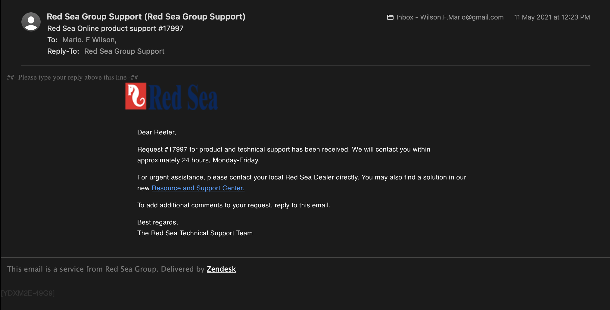
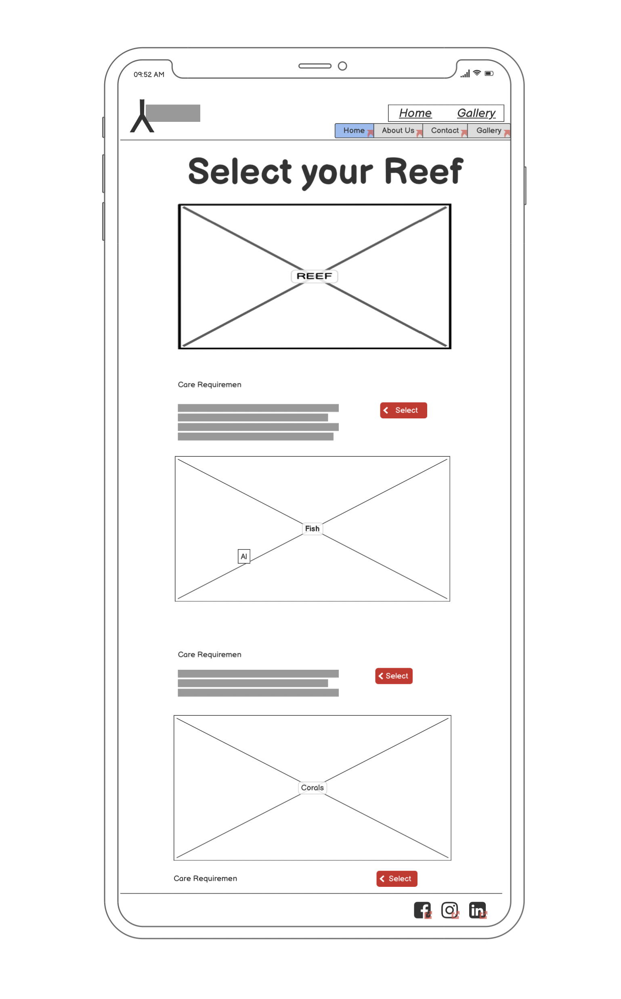
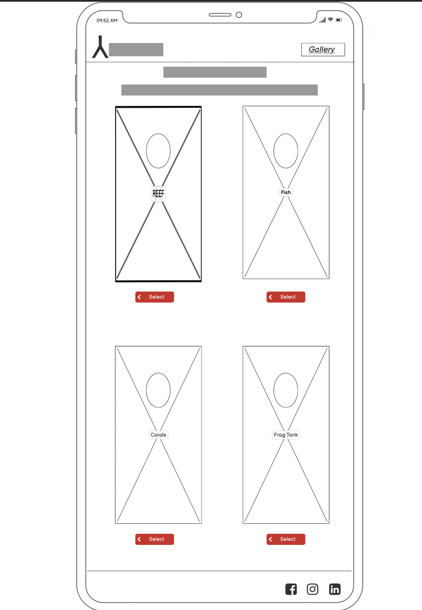
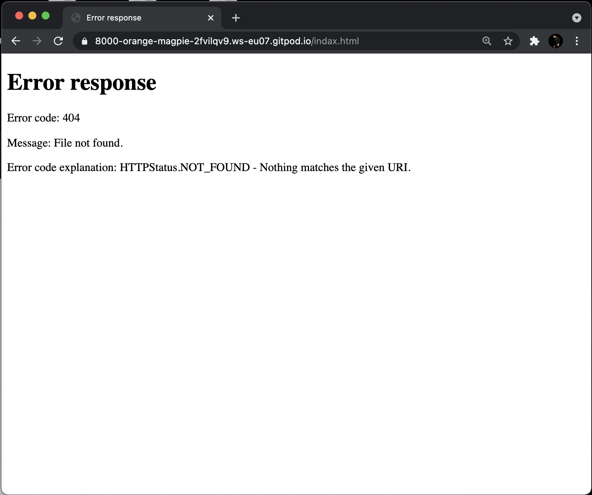

[](https://gitpod.io/#https://github.com/Spotarachy/My-M1-MFW)


## ```Brining The Ocean To You,```

https://spotarachy.github.io/My-M1-MFW/



---
```
About 
```

/* This is my Milstone M1 Full Stack Software Developmnet projcet, this is a end user Centric best Developmnet by Mario F Wilson, injoy. */

At Red Sea Reef our vision has been to create a world in which marine and reef aquarium are the aquarium of choice for all hobbyists, this has a greatly impacted how the company has foucs on projcet Developmnetand & design.

In keeping wiht the company's objectve to make successful reef-keeping accessible to a wider audience, form novices to experienced hobbyists, Red Sea Reef Developmnet its ground-breaking range of reef aquarium systems.


## Table of contents

[UX - User Experience](#ux)
   * [Project Goals](#project-goals)
   * [User Stories](#user-stories)
     1. Visitiing the site for the fist time
     2. Returning Visitor to the site
     3. Frequent User to the site

[Design](#design-choices)

   * [Colours](#colours)
   * [Typography](#typography)
   * [Images](#images)
   * [Icons](#icons)
   * [Layout](#layout)
   * [Wireframes](#wireframes)

 [Features](#Features)

  * [Validator](#validator)
  * [Testing](#Testing)
  * [Further-testing](#further testing)
     1. index.html
     2. desktop
     3. perfromace 
  * [Known-Bugs](#known Bugs)

  [Developmnet](#Developmnet)

   * [Github page](#Github)
   * [Credit](#Credit)
   * [Acknowledgements](#Acknowledgement)


---
```
UX - User experience
```
In this website you will find three different ways you can set up a Marine  Aquarium and there care requirements, in  About Us page their are  videos information form customers aquariums in an all in one platform you will also find a link to our contact page if any hiccups arrive this website is billed for the customers to share their inspiration through our gallery page

 ### ```Project Goals ```
 
 1. To Provide a easy to understard  webpage to learn about their aquarium.
 
 2. To Provide all the tools need to ensure a happy and healthy reef tank.
 
 3. To give a brief explanation and clarity to what the customer needs.
 
 4. to Provide a hassle free set up an information with video demonstration.
 
 5. To inspire a generation to take care of our oceans in the life we did it.

 6. To provide a clear and easy place for contacting and receiving additional advice about the systems set up.
 
 
### ```User Stories```
 1.**Visitiing the site for the fist time :**

  7. As a First time Visitor,I want the site to have a fast loading time.
  8. As a First time Visitor,I Want to be able to use a website on any device.
  9. As a First time Visitor I want to able to learn and easily understand what the website is about.
  10.  As a First time Visitor I  Want to feel the commitment to the end-users.
  11.  As a First time Visitor I Want a quick and easy to navigate or the page & not overloaded with information.
  12. As a First time Visitor I want to be able to click and visit social media, and others for more content and to keep up to date with future postings and developments.
  13.  Knowing priceing for each type of set up.
  14.  Finding out as much as possible about the care requirements.
  15.  I want to access contact information, such as address, phone numbers and location.
  16.  Being able to navigate quickly through out  part of the website.

 2.**Returning Visitor to the site:**

  17.  A quick loading website using a combintion of from over focus, the website that load on mobile device just as well as just as well as desktop devices.

  18. A quick and responsive platform that all user can injoy  

  19.  A Design that is easy & clear call's to action,to able to navigate the website Features.

  20.  As a Returning Visitor the website to be both informational-based and social media-based to keep both parties equally and Informed.  

  21.  As a Returning Visitor i want the layout will be easy to navigate with Clare buttons In the top menu bar for ease of use.

 3.**Frequent User to the site:**

  22.  As a Frequent User, I wanrt to See a clear part to anything newly added item.

  23.  As a Frequent User, want to keet update wiht Stories form others to also visito the site true social media, Facebook, Twitter etc...

  24.  As s Frequent User, want to know if their more any event's coming up, where i can sign up, for Newsletter.

  4.**Site Owner goals:**
  
  25. A webpage where we can show case all the good's and services that we offer.

  26. A site that is directly show are customer where to go, for thire informationalneed.

  27. a webpage that can help us connect stroies & experiences.
  
  28. a site that can be update, easliy 


```
Designs  
```
### ```Colours```

 * There are Four main RGB Colour that well be uesd through the website:
  * RER (252, 14, 40) or FCOE28
  * White ( 255,255,255) or FFFFFF
  * Blue/Purple  ( 128,134,237) or 8086ED
  * Gray (219,219,220) or DBDBDC 
 
 From: Coolors Palette:
      [MIT](https://coolors.co/fc0e28-ffffff-8086ed-dbdbdc)
  
---

### ```Typography```
  * The main font that is going to be use is Roboto, Regular 400, this font is going be uesd through the whole website, this font came form Google fonts.
    * Why Roboto:
      [MIT](https://fonts.google.com/specimen/Roboto#about)
  

 * The back up font will be poppins, at 100 italic, just in case the main font is not loading propely on the website, this font is also will be Source form Google Fonts.
    * Why Poppins: 
      [MIT](https://fonts.google.com/specimen/Poppins#about)

---

### ```Images```
 * Images will be Source for [Pexels](https://www.pexels.com/search/coral%20reef/) For Free to uesd images form [my account](https://www.pexels.com/@mario-f-wilson-58865816).

 * Images & Video will also be Source from [redseafish](https://www.redseafish.com), where permission to use these images & videos in this projcet was requested.
 


---

### ```Icons```

The icons for Social Media were sourced form [Font Awesome](https://fontawesome.com) and [Google Fonts](https://fonts.google.com/icons)

---

### ```Wireframes```

*Home Page*:


### ```Moblie Wireframes:```







*Download Here:*

[Home page  2021-05-11 at 10.12.13 PM.pdf](https://github.com/Spotarachy/My-M1-MFW/files/6471154/Home.page.2021-05-11.at.10.12.13.PM.pdf)

[About us 2021-05-11 at 10.13.15 PM.pdf](https://github.com/Spotarachy/My-M1-MFW/files/6471156/About.us.2021-05-11.at.10.13.15.PM.pdf)

[Cantact 2021-05-11 at 10.14.12 PM 1.pdf](https://github.com/Spotarachy/My-M1-MFW/files/6471160/Cantact.2021-05-11.at.10.14.12.PM.1.pdf)

[Gallery  2021-05-11 at 10.14.58 PM.pdf](https://github.com/Spotarachy/My-M1-MFW/files/6471158/Gallery.2021-05-11.at.10.14.58.PM.pdf)

---

```
Features
 ```
 
 * Navigetion buttons well all be responsive

 * Will be made wiht interactive elements 

 * Languages Used
   * HTML5 [link to HTML5!](https://en.wikipedia.org/wiki/HTML5)
  
   * CSS3 [link to CSS3!](https://en.wikipedia.org/wiki/CSS)

   * Bootstrap [link to Bootstrap!](https://getbootstrap.com/)

* Ipad pro editer:
   * was used to create the logo, resizing images and editing photos for the website.

* Wireframes made with Balsamiq [link to Balsamiq!](https://balsamiq.com/)

---
    
### ```Validator ```

* HTML
  * No errors were found when running this webpage true the HTML5 validator website [W3C validator!](https://validator.w3.org/)

* CSS3
  * No errors were found when running this webpage true the CSS3 validator website [Jigsaw!](https://jigsaw.w3.org/css-validator/)

### ``` Testing ```

   * 404 
   * This page is only accessed if a user types an incorrect web address in the browser navigation bar.

   * This page contains the following section: A "humourous message" notifying the user of an error. This will then allows the user to defect that the web address thire trying to locate doens't exist.
     * There is one call-out button in this section, allowing user to return to the home page! 

#### Further testing 
  * Moblie Testing
     1. index.html
     2. desktop
     3. performance

  * Features to implement 
   * Adding Teram and condition 
   * Adding Privacy Step update 
   * Detailed contact information, Auto log in 
   * Adding a two step anthenticator, for payments 
   * Detailed reef safe fish & coral
  
---
### ```Known Bugs```

   *   The fist bug that was found out too be a 404.error, it keet the webpage form loading back to it's "Home" page on the website, after looking it over i found that in the gallery,html file, in the class element it was speeled as: "indax.html"

   * 

 
 

---

```
Developmnet
```

### ```Github Page```

The hold webpage will be accessible on the github server, where the code and readme.md file well be add for information. 

[link to github ](https://github.com/Spotarachy/My-M1-MFW)

Following this helpfull guide to the step's: sourced form the [GitHub.com/Code Institute README Sample](https://github.com/Code-Institute-Solutions/SampleREADME)


>Log in to GitHub and locate the GitHub Repository,Spotarachy/My-M1-MFW

>At the top of the Repository (not top of page), locate the "Settings" Button on the menu.

>Alternatively Click Here for a GIF demonstrating the process starting from Step 2.

>Scroll down the Settings page until you locate the "GitHub Pages" Section.

>Under "Source", click the dropdown called "None" and select "Master Branch".

>The page will automatically refresh.

>Scroll back down through the page to locate the now published site link in the "GitHub Pages" section


### ``` Credit ```
 * Pexels for there Free to uesd Photo.
   * here you will find the 4 artis name form the my porfile: [MIT](https://www.pexels.com/@mario-f-wilson-58865816)

       * Artem Mizyuk
       * Tom Fisk
       * Franceseco Ungaro 
       * Nadia Chiesi
       * the text 
       * Media
       * link images 1

     https://www.coralandfishstore.nl/zeeaquarium/kaal-aquarium/waterbox-marine-x-90-3-white.html?gclid=CjwKCAjwnPOEBhA0EiwA609ReU_kFClSMQ05VgjI8wS8XmHaLyyRDefsLMBQUbfY2u9DSfOuR-AAjxoCz5UQAvD_BwE

     https://www.coralandfishstore.nl/15397-large_default/waterbox-marine-x-90-3-white.jpg

 

 
### ``` Acknowledgements ```


 John Traas, from the slack comuitfor his supprt.

 
* Google Fonts
  * https://fonts.google.com/?query=pop

* images
  * https://www.redseafish.com

  * https://worldwidecorals.com/collections/soft-coral/products/burning-superman-rhodactis-mushroom-13130
  
  * Photo by Egor Kamelev from [Pexels](https://www.pexels.com/photo/macro-photography-of-white-coral-920163/)

* Page Colour
  * https://coolors.co/fc0e28-ffffff-8086ed-dbdbdc

* Friend's Reef tank
  * https://www.instagram.com/seadreams_reeftanks/ 

* Sample README.md file
  * https://github.com/Code-Institute-Solutions/SampleREADME 

