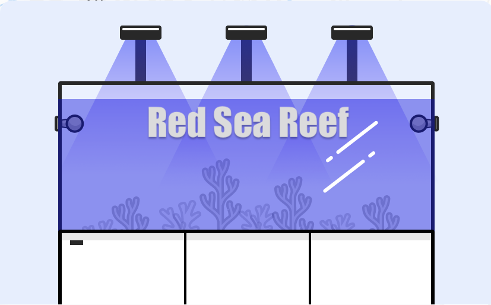
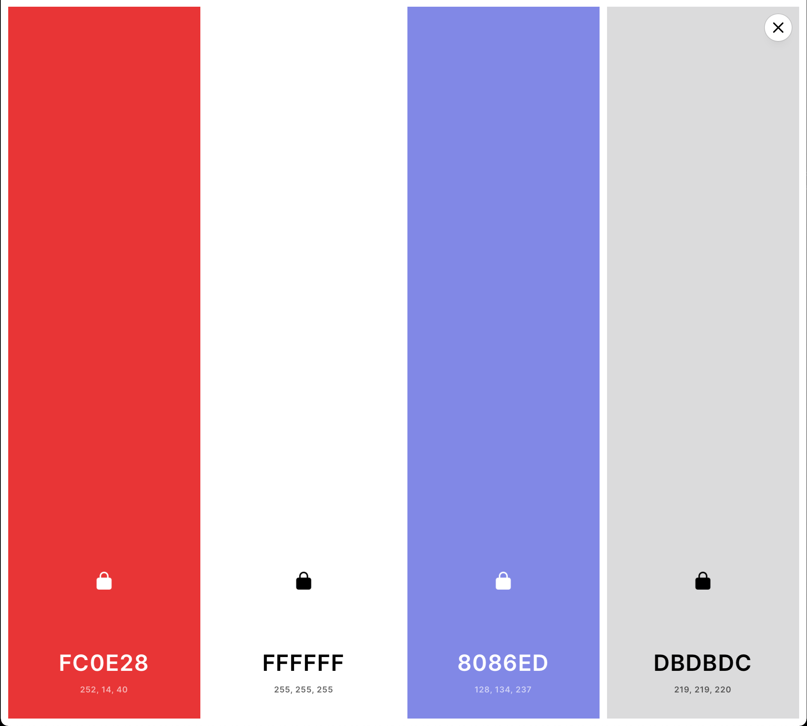

( link to webpage Here)



 # Red Sea Reef #

#### Bring the Ocean to you.
---
```bash
About 
```

/* This is my Milstone M1 Full Stack Software Developmnet projcet, this is a end user Centric best Developmnet by Mario F Wilson, injoy. */

At Red Sea Reef our vision has been to create a world in which marine and reef aquarium are the aquarium of choice for all hobbyists, this has a greatly impacted how the company has foucs on projcet Developmnetand & design.

In keeping wiht the company's objectve to make successful reef-keeping accessible to a wider audience, form novices to experienced hobbyists, Red Sea Reef Developmnet its ground-breaking range of reef aquarium systems.

---
```bash
UX 
```
In this website you will find three different ways you can set up a Marine  Aquarium and there care requirements, in  About Us page their are  videos information form customers aquariums in an all in one platform you will also find a link to our contact page if any hiccups arrive this website is billed for the customers to share their inspiration through our gallery page

 ## Project Goals ##
 
 * To Provide a easy to understard  webpage to learn about their aquarium.
 
 * To Provide all the tools need to ensure a happy and healthy reef tank.
 
 * To give a brief explanation and clarity to what the customer needs.
 
 * to Provide a hassle free set up an information with video demonstration.
 
 * To inspire a generation to take care of our oceans in the life we did it.

 * To provide a clear and easy place for contacting and receiving additional advice about the systems set up.
 
 
## User Stories ##
**Visitiing the site for the fist time :**

* As a First time Visitor,I want the site to have a fast loading time.
* As a First time Visitor,I Want to be able to use a website on any device.
* As a First time Visitor I want to able to learn and easily understand what the website is about.
* As a First time Visitor I  Want to feel the commitment to the end-users.
* As a First time Visitor I Want a quick and easy to navigate or the page & not overloaded with information.
* As a First time Visitor I want to be able to click and visit social media, and others for more content and to keep up to date with future postings and developments.
* Knowing priceing for each type of set up.
* Finding out as much as possible about the care requirements.
* I want to access contact information, such as address, phone numbers and location.
* Being able to navigate quickly through out  part of the website.

**Returning Visitor to the site:**

* A quick loading website using a combintion of from over focus, the website that load on mobile device just as well as just as well as desktop devices.

* A quick and responsive platform that all user can injoy  

* A Design that is easy & clear call's to action,to able to navigate the website Features.

* As a Returning Visitor the website to be both informational-based and social media-based to keep both parties equally and Informed.  

* As a Returning Visitor i want the layout will be easy to navigate with Clare buttons In the top menu bar for ease of use.

**Frequent User to the site:**

* As a Frequent User, I wanrt to See a clear part to anything newly added item.

* As a Frequent User, want to keet update wiht Stories form others to also visito the site true social media, Facebook, Twitter etc...

* As s Frequent User, want to know if their more any event's coming up, where i can sign up, for Newsletter.


```bash
Design  
```
*Colour*
* There are Four main RGB Colour that well be uesd through the website:
  * RER (252, 14, 40) or FCOE28
  * White ( 255,255,255) or FFFFFF
  * Blue/Purple  ( 128,134,237) or 8086ED
  * Gray (219,219,220) or DBDBDC


From: Coolors Palette:
  [MIT](https://coolors.co/fc0e28-ffffff-8086ed-dbdbdc)


*Typography*
  * The main font is going to be use is Roboto Regular 400, this font is going be uesd through the whole website, this font came form Google fonts.
  * Why Roboto:
      [MIT](https://fonts.google.com/specimen/Roboto#about)
  
  
  
  <link rel="preconnect" href="https://fonts.gstatic.com"> 
<link href="https://fonts.googleapis.com/css2?family=Roboto&display=swap" rel="stylesheet">
<style>
@import url('https://fonts.googleapis.com/css2?family=Roboto&display=swap');
</style>

 * The back up font willbe poppins at 100 italic, jiust in case the main font is not loading propely on the website, this font is also will be Source form Google Fonts.
 * Why Poppins: 
   [MIT](https://fonts.google.com/specimen/Poppins#about)


<link rel="preconnect" href="https://fonts.gstatic.com"> 
<link href="https://fonts.googleapis.com/css2?family=Poppins:ital,wght@1,100&display=swap" rel="stylesheet">
<style>
@import url('https://fonts.googleapis.com/css2?family=Poppins:ital,wght@1,100&display=swap');
</style>

*Images*
 * Images will be Source for google Form Free to uesd images.
 * Images will also be Source from redseafish, where permission to use these images in this projcet was requested.
 
    

---
```bash
Wireframes
```
Home Page:


Moblie Wireframes:


Download Here:
[Home page  2021-05-11 at 10.12.13 PM.pdf](https://github.com/Spotarachy/My-M1-MFW/files/6471154/Home.page.2021-05-11.at.10.12.13.PM.pdf)


[About us 2021-05-11 at 10.13.15 PM.pdf](https://github.com/Spotarachy/My-M1-MFW/files/6471156/About.us.2021-05-11.at.10.13.15.PM.pdf)


[Cantact 2021-05-11 at 10.14.12 PM 1.pdf](https://github.com/Spotarachy/My-M1-MFW/files/6471160/Cantact.2021-05-11.at.10.14.12.PM.1.pdf)


[Gallery  2021-05-11 at 10.14.58 PM.pdf](https://github.com/Spotarachy/My-M1-MFW/files/6471158/Gallery.2021-05-11.at.10.14.58.PM.pdf)

---
link images 1


https://www.coralandfishstore.nl/zeeaquarium/kaal-aquarium/waterbox-marine-x-90-3-white.html?gclid=CjwKCAjwnPOEBhA0EiwA609ReU_kFClSMQ05VgjI8wS8XmHaLyyRDefsLMBQUbfY2u9DSfOuR-AAjxoCz5UQAvD_BwE

https://www.coralandfishstore.nl/15397-large_default/waterbox-marine-x-90-3-white.jpg

---
**Existing Features**

 * Navigetion Bar 
    


### H3 Headings
#### H4 Headings

---

## Lists

1.A list wiht number

2.A list wiht number 

3.A list wiht number

* A list wiht bullet points 
* A list wiht bullet points
* A list wiht bullet points

[A link to github] (https://github.com)    ->Mario this how it made to link webpage!

        ->this how to place an image, like a logo!

---

## Tables

## Features 

We invite you to learn more about these solutions and look forward to helping you make your home reef aquarium a dream come true.
 
## Source


* Google Fonts
  * https://fonts.google.com/?query=pop

* images
  * https://www.redseafish.com

* Page Colour
  * https://coolors.co/fc0e28-ffffff-8086ed-dbdbdc


* Friend's Reef tank
  * https://www.instagram.com/seadreams_reeftanks/ 
